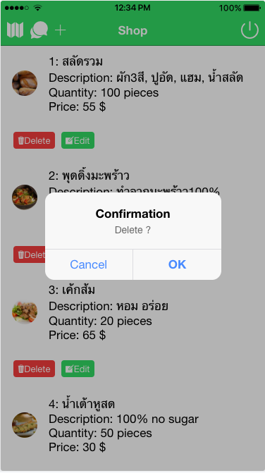

# Franchise Management System 
Members: <br />
         1.Sirapat N.     57070503438  <br /> 
         2.Thanaboon M.   57070503415  <br /> 
         3.Chalaemkwan B. 57070503444  <br />
<br /> This project uses the [MEAN stack](https://en.wikipedia.org/wiki/MEAN_(software_bundle)):
* [**I**onic 2](http://ionicframework.com/docs/intro/installation/) frontend framework
* [**A**ngular 2](https://angular.io): frontend framework
* [**E**xpress.js](http://expressjs.com): backend framework
* [**N**ode.js](https://nodejs.org): runtime environment
* [MongoDB](https://www.mongodb.com): database
<br />
A management system for managing sale orders between franchise owner and minor companies/dealers. The system will allow the franchise owner to CRUD products’ informations. The minors/dealers can view and order the products. 
<br />
This is a project in CPE333 Software Engineering.

# Prerequisites 
1. Install [Node.js](https://nodejs.org) for Linux/OSX users [Windows users click on the link]
``` for Linux/OSX for windows go to the webpage
$ brew install node
```
2. Install [MongoDB](https://www.mongodb.com) for Linux/OSX users [Windows users click on the link]
``` 
$ brew install mongodb
```
3. Install [Ionic Client](https://ionicframework.com/docs/intro/installation)
```
$ npm install -g ionic cordova
```
4. In both fms/client/fms and fms/sever folder install all the dependencies:
```
$ npm install
```
5. In fms/client/fms install additional lib [angular2-jwt](https://www.npmjs.com/package/angular2-jwt)
```
$ npm install angular2-jwt
```

# How to run
In server folder
```
$ node server.js
```
In client folder 
```
$ ionic serve --lab
```

# Screenshots




